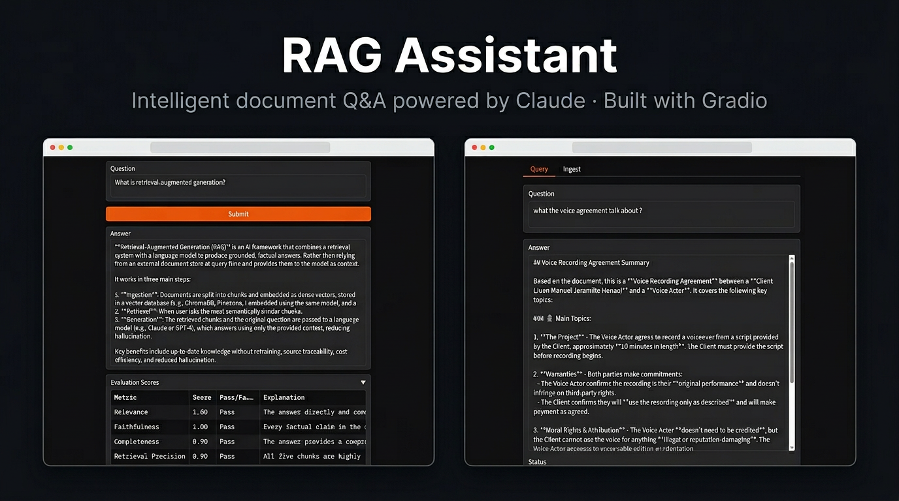

# RAG Assistant

A production-quality, open-source Retrieval-Augmented Generation (RAG) system
built with LangChain, ChromaDB, HuggingFace embeddings, and Anthropic Claude.
Ingest your documents, ask questions in plain English, and get grounded,
source-traceable answers — complete with automatic quality evaluation and
multi-scenario fallback handling.

---

## Screenshots



## Features

- **Flexible ingestion** — `.txt`, `.pdf`, `.md`, `.html` files or entire directories
- **Semantic retrieval** — local HuggingFace embeddings + ChromaDB vector store
- **Claude-powered generation** — primary model with exponential-backoff retry and automatic downgrade to haiku on failure
- **4-metric evaluation** — answer relevance, context faithfulness, retrieval precision, completeness (parallel LLM-as-judge calls)
- **4-scenario fallback logic** — OOS detection, no-context abstention, low-score re-query, API-error model downgrade
- **Browser UI** — Gradio web interface with Query and Ingest tabs, evaluation scores, and source previews (port 7860)
- **Docker support** — one-command ingest and query with volume-mounted persistence
- **Zero hardcoded values** — all knobs live in typed `dataclass` config objects

---

## Quick Start (Docker) — 3 commands

Sample documents are included (`sample_docs/`), so you can test immediately without
providing your own files.

```bash
git clone https://github.com/your-org/rag-assistant.git
cd rag-assistant

# 1. Add your Anthropic API key
cp .env.example .env
# open .env and set ANTHROPIC_API_KEY=sk-ant-...

# 2. Build + ingest the bundled sample documents
make build
make ingest

# 3. Ask a question
make query Q="What is retrieval-augmented generation?"

# Verbose mode — shows all 4 evaluation scores + retrieval metadata
make query-verbose Q="What vector databases does this system support?"
```

To use your own documents instead of (or in addition to) the samples:

```bash
# drop files into ./docs/ and ingest
mkdir -p docs
cp /path/to/your/files/* docs/
docker compose run --rm rag python -m rag_assistant ingest /app/docs
```

> **Windows users:** `make` is not available by default. Use the Docker commands
> directly — see [Windows (no make)](#windows-no-make) below.

---

## Browser UI (Gradio)

The easiest way to explore the assistant is the Gradio web UI.
It runs as a separate Docker Compose service and shares the same vector store
as the CLI, so documents ingested via `make ingest` are immediately queryable
in the browser.

**Mac / Linux:**

```bash
make build          # build image (includes gradio)
make ingest         # ingest sample docs (only needed once)
make ui             # start the UI
```

**Windows (no make):**

```bash
docker compose build
docker compose run --rm rag python -m rag_assistant ingest /app/sample_docs
docker compose up ui
```

Then open **http://localhost:7860** in your browser.

The UI has two tabs:

| Tab | What it does |
|---|---|
| **Query** | Ask a question — shows the answer, model used (or fallback warning), evaluation scores, and retrieved source snippets |
| **Ingest** | Upload `.txt` / `.pdf` / `.md` / `.html` files, or enter a server-side directory path |

Press `Ctrl+C` in the terminal to stop the UI.

---

## Trying the UI with the Sample Documents

Three topics are covered by the bundled `sample_docs/`. Use the questions below
to explore all parts of the UI.

### RAG questions

```
What is retrieval-augmented generation?
What are the benefits of RAG?
How does RAG work step by step?
```

### LLMs & Claude questions

```
What is Claude and who made it?
What are the different Claude model families?
What can large language models do?
```

### Vector database questions

```
What vector databases does this system support?
How does ChromaDB store embeddings?
```

### Testing fallback handling

These questions are outside the knowledge base and should trigger a
**Warning** in the Status field instead of a normal answer:

```
What is the weather today?
Who won the Super Bowl?
```

### What to look at in the UI

**Status field** (below the answer):
- `Model: claude-sonnet-4-6` — normal successful answer
- `Warning: ...` — a fallback was triggered (out-of-scope, no relevant context found, or answer quality too low)

**Evaluation Scores accordion** — expand it after any successful answer to see
the four LLM-as-judge metrics:

| Metric | What it measures |
|---|---|
| Relevance | Does the answer address the question? |
| Faithfulness | Is the answer grounded in the retrieved chunks? |
| Completeness | Does the answer cover all important aspects? |
| Retrieval Precision | Were the retrieved chunks actually useful? |

Each metric shows a score (0–1) and a Pass / Fail based on the configured
threshold, plus a one-sentence explanation from the judge model.

**Retrieved Sources accordion** — shows which document chunks were retrieved
and their similarity scores. Useful for verifying that the right content was
pulled from your documents.

---

## Windows (no make)

`make` is a Unix tool not included with Windows. All `make` targets have a
direct `docker compose` equivalent:

| `make` command | Windows equivalent |
|---|---|
| `make build` | `docker compose build` |
| `make ingest` | `docker compose run --rm rag python -m rag_assistant ingest /app/sample_docs` |
| `make query Q="..."` | `docker compose run --rm -e QUERY="..." rag` |
| `make query-verbose Q="..."` | `docker compose run --rm rag python -m rag_assistant query "..." --verbose` |
| `make ui` | `docker compose up ui` |
| `make clean` | `Remove-Item -Recurse -Force chroma_db` (PowerShell) or `rmdir /s /q chroma_db` (Command Prompt) |

Alternatively, install `make` via [Chocolatey](https://chocolatey.org/) (run
PowerShell as Administrator):

```powershell
choco install make
```

Or via [Winget](https://learn.microsoft.com/en-us/windows/package-manager/winget/):

```powershell
winget install GnuWin32.Make
```

Restart your terminal after installing and the `make` commands will work normally.

---

## Quick Start (Local)

```bash
git clone https://github.com/your-org/rag-assistant.git
cd rag-assistant

# 1. Create and activate a virtual environment
python -m venv .venv
source .venv/bin/activate        # Windows: .venv\Scripts\activate

# 2. Install dependencies
pip install -r requirements.txt

# 3. Set your API key
export ANTHROPIC_API_KEY=sk-ant-...   # Windows: set ANTHROPIC_API_KEY=...

# 4. Ingest documents
python -m rag_assistant ingest ./docs/

# 5. Query
python -m rag_assistant query "What is X?" --verbose
```

The `--verbose` flag prints the full `RAGResponse` JSON, including all four
evaluation scores, retrieval scores, and fallback metadata.

---

## Configuration

All configuration is managed through typed dataclasses in `rag_assistant/config.py`.
You can override defaults via a JSON file:

```bash
python -m rag_assistant query "What is X?" --config my_config.json
```

Example `my_config.json`:

```json
{
  "retrieval": { "top_k": 8, "similarity_threshold": 0.4 },
  "generation": { "primary_model": "claude-opus-4-6", "max_tokens": 2048 },
  "fallback": {
    "domain_description": "Python programming and software engineering"
  }
}
```

See [ARCHITECTURE.md — Configuration Reference](ARCHITECTURE.md#7-configuration-reference)
for a full list of all fields and their defaults.

---

## Architecture

See [ARCHITECTURE.md](ARCHITECTURE.md) for:

- System architecture diagram
- Component responsibilities
- Step-by-step data flow
- Evaluation and fallback design
- Extension guide (swap vector store, add metrics, change LLM)

---

## Contributing

Contributions are welcome! To get started:

1. Fork the repository and create a feature branch.
2. Make your changes with clear commit messages.
3. Ensure existing functionality is not broken (manual testing steps in
   [ARCHITECTURE.md — Verification](ARCHITECTURE.md)).
4. Open a pull request describing what you changed and why.

Please follow the existing code style (standard `black` formatting, type hints
throughout) and keep functions small and focused.

---

## License

[MIT](LICENSE) — © 2026 [Juan]
